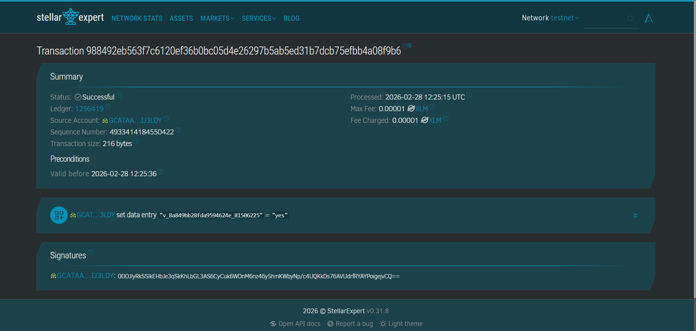

# Stellar Yellow Belt Project 🚀

## 📌 Project Overview
This project is a **Live Poll dApp** built on the Stellar blockchain.  
It allows users to connect their wallet and participate in a real-time poll system.

---

## 🌐 Live Demo
https://stellar-yellow-belt.vercel.app

---

## ⚙️ Setup Instructions

1. Clone the repository:
git clone https://github.com/harshaljagdale0222/stellar-yellow-belt.git

2. Navigate to project folder:
cd stellar-yellow-belt

3. Install dependencies:
npm install

4. Run the project:
npm run dev

---

## 🔗 Wallet Integration
- Connect using Freighter Wallet  
- Ensure wallet is unlocked before interaction  

---

## 📸 Screenshots

### Wallet Connected

### Transaction Success

### App UI

---

## 📦 Smart Contract Details

- **Contract Address:** CA4QCBLGGFS55SYUMJTTQ7JGPX4TZIWP4SJ4YUL6PR6GB7LQZEWCR6TC  
- **Transaction Hash:** 7ff7b88db5be060fc826d34870dfe55d81ba30931c57dc582f548603501ff10e  

🔗 **View on Stellar Expert:**  
https://stellar.expert/explorer/testnet/tx/7ff7b88db5be060fc826d34870dfe55d81ba30931c57dc582f548603501ff10e

---

## 🛠️ Tech Stack
- Vite + JavaScript  
- Stellar SDK  
- Freighter Wallet  

---

## 👨‍💻 Author
Harshal Jagdale
