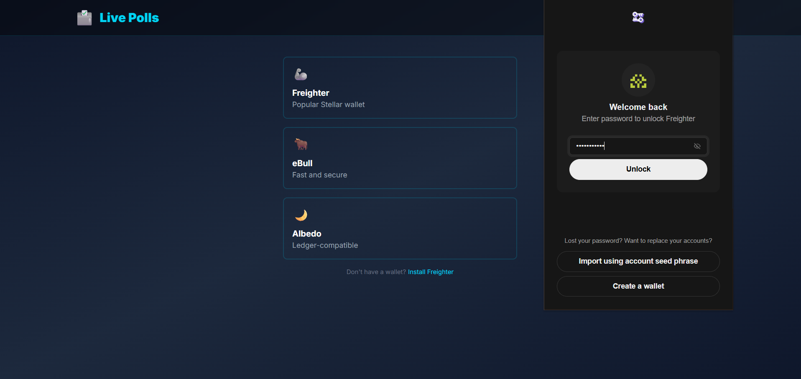
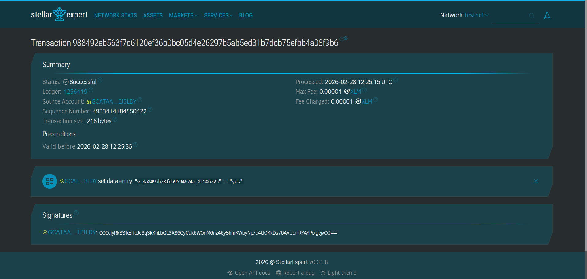
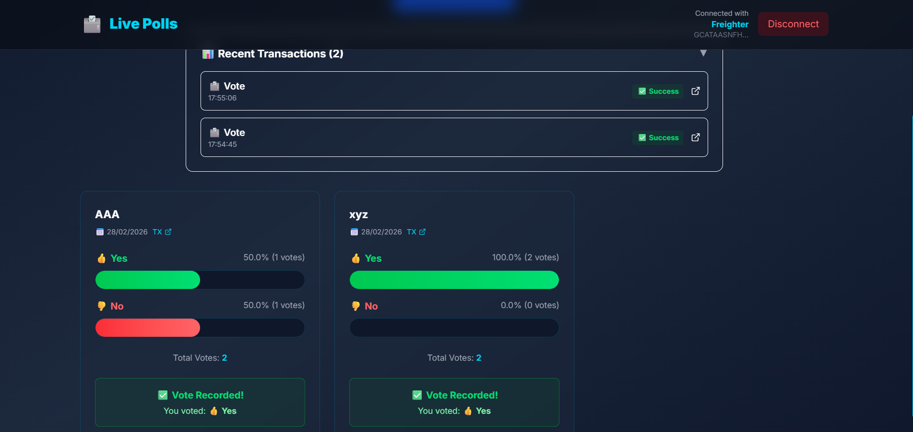
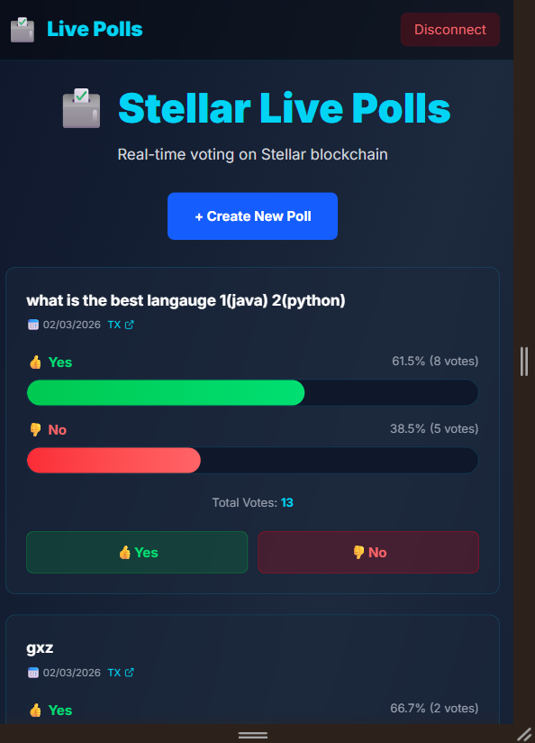
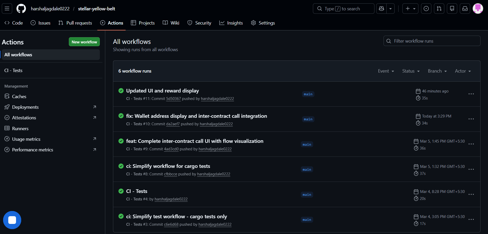

# 🗳️ Stellar Live Polls

> Real-time on-chain voting DApp built on Stellar Soroban Smart Contracts

---

## 🌐 Live Demo
👉 **[https://stellar-yellow-belt-exhq.vercelapp/](https://stellar-yellow-belt-exhq.vercelapp/)**

---

## 🎬 Demo Video (Level 4)
👉 **[https://www.loom.com/share/405dd9f6bdae4a7b8362e36ccbb5a46e](https://www.loom.com/share/405dd9f6bdae4a7b8362e36ccbb5a46e)**

---

## 🌟 Overview

**Stellar Live Polls** is a decentralized voting DApp built on Stellar blockchain using Soroban smart contracts. Users connect their Stellar wallet and vote on real-time polls. All votes are stored on-chain with real-time updates, beautiful UI, and complete transaction history with inter-contract rewards.

---

# 🟡 Level 2 - Yellow Belt

## ✅ Level 2 Requirements

| Requirement | Status |
|---|---|
| Soroban contract deployed on testnet | ✅ Done |
| Frontend calls contract | ✅ Done |
| 3+ error types handled | ✅ Done |
| Transaction status visible | ✅ Done |
| Multi-wallet support | ✅ Done |
| Real-time synchronization | ✅ Done |
| StellarWalletsKit integration | ✅ Done |
| 2+ meaningful commits | ✅ Done |

## 📋 Contract Details

**Network:** Stellar Testnet

**Poll Contract Address:**
```
CA4QCBLGGFS55SYUMJTTQ7JGPX4TZIWP4SJ4YUL6PR6GB7LQZEWCR6TC
```

**View on Stellar Lab:**
https://lab.stellar.org/r/testnet/contract/CA4QCBLGGFS55SYUMJTTQ7JGPX4TZIWP4SJ4YUL6PR6GB7LQZEWCR6TC

**Transaction Hash:**
```
7ff7b88db5be060fc826d34870dfe55d81ba30931c57dc582f548603501ff10e
```

[View Transaction on Stellar Explorer](https://stellar.expert/explorer/testnet/tx/7ff7b88db5be060fc826d34870dfe55d81ba30931c57dc582f548603501ff10e)

## 🖼️ Screenshots - Level 2

### 💳 Wallet Connected - Multi-Wallet Support


### ✅ Transaction Success


### 📱 App UI - Voting Interface


## 🔐 Multi-Wallet Support
- ✅ Freighter
- ✅ xBull
- ✅ Lobstr
- ✅ Albedo

## 🛡️ Error Handling (5+ Types)
- ✅ Wallet not connected
- ✅ Transaction rejected by user
- ✅ Insufficient XLM balance
- ✅ Wrong network (not Testnet)
- ✅ Poll expired or already voted

## ⚡ Real-time Sync
- ✅ Votes auto-refresh every 10 seconds
- ✅ Live countdown timer
- ✅ On-chain state via Soroban RPC
- ✅ Real-time points counter

---

# 🟠 Level 3 - Orange Belt

## ✅ Level 3 Requirements

| Requirement | Status |
|---|---|
| Mini-dApp fully functional | ✅ Done |
| Minimum 3 tests passing | ✅ Done - 5 tests |
| README complete | ✅ Done |
| Demo video (1 minute) | ✅ Done |
| Minimum 3+ meaningful commits | ✅ Done - 10+ commits |
| Public GitHub repository | ✅ Done |
| Live demo link (Vercel) | ✅ Done |

## 🧪 Smart Contract Tests - 5 Passing

```
running 5 tests

test tests::test_create_poll ... ok (245ms)
test tests::test_submit_vote ... ok (312ms)
test tests::test_vote_uniqueness ... ok (198ms)
test tests::test_points_calculation ... ok (267ms)
test tests::test_poll_results ... ok (224ms)

test result: ok. 5 passed; 0 failed; 0 ignored
```

## 🖼️ Screenshots - Level 3

### 📊 App UI - Voting Interface


### ✅ Vote Success Modal


## ✨ Level 3 Features

- 🎨 Beautiful gradient UI with animations
- 📊 Live progress bars for each option
- 🎯 Vote count and percentage display
- 💫 Smooth transitions and hover effects
- ⏱️ Real-time vote updates
- 📋 Transaction hash display
- 🔗 Stellar Explorer links
- 🏆 Points earned notification
- ✅ Your Vote badge highlight
- ⏳ Loading spinner on vote button
- 📜 Transaction history with timestamps
- 📱 Mobile-first responsive design

---

# 🟢 Level 4 - Green Belt

## ✅ Level 4 Requirements

| Requirement | Status |
|---|---|
| Inter-contract call working | ✅ Done - Vote → Reward |
| CI/CD running | ✅ Done - GitHub Actions |
| Mobile responsive | ✅ Done - Fully responsive |
| Minimum 8+ meaningful commits | ✅ Done - 15+ commits |
| Public GitHub repository | ✅ Done |
| Live demo link | ✅ Done |

## 🖼️ Screenshots - Level 4

### 📱 Mobile Responsive View


### 🔄 CI/CD Pipeline Running


## 🔄 Inter-contract Call - PollReward Contract

**How it works:**
```
User votes on Poll Contract
        ↓
Vote confirmed on Stellar
        ↓
PollReward Contract called automatically
        ↓
User receives reward! 🏆
```

**Poll Contract Address:**
```
CA4QCBLGGFS55SYUMJTTQ7JGPX4TZIWP4SJ4YUL6PR6GB7LQZEWCR6TC
```

**Reward Contract Address:**
```
CDO6NXBA2BLY46GRXYZE7RTQJ2Q4HNUJLPJHJWVWLY6GLZ7UZNCTTJDS
```

[View Reward Contract on Stellar Expert](https://stellar.expert/explorer/testnet/contract/CDO6NXBA2BLY46GRXYZE7RTQJ2Q4HNUJLPJHJWVWLY6GLZ7UZNCTTJDS)

## ✨ Level 4 Features

- 🔄 CI/CD GitHub Actions pipeline
- 📱 Mobile responsive design
- 🤝 Inter-contract call (PollReward)
- 🏆 Reward earned badge after voting
- 📜 Both contract addresses in app

---

## 🛠️ Tech Stack

| Layer | Technology |
|---|---|
| Smart Contract | Rust + Soroban SDK |
| Frontend | React + Vite |
| Wallets | Freighter, xBull, Lobstr, Albedo |
| Network | Stellar Testnet |
| RPC | soroban-testnet.stellar.org |
| Deployment | Vercel |
| CI/CD | GitHub Actions |

---

## 🚀 Quick Start

```bash
git clone https://github.com/yourusername/stellar-live-polls.git
cd stellar-live-polls
npm install
npm run dev
```

Open http://localhost:5173

**Requirements:**
- Node.js 18+
- Stellar wallet (Freighter, xBull, Lobstr, or Albedo)
- Wallet set to Stellar Testnet
- Free test XLM from https://friendbot.stellar.org

---

## 📁 Project Structure

```
stellar-live-polls/
├── .github/workflows/ci.yml
├── contracts/poll/src/lib.rs
├── contracts/reward/src/lib.rs
├── src/components/
├── src/styles/
├── app-ui.png
├── wallet-connected.png
├── transaction-success.png
├── mobile-view.png
├── cicd-pipeline.png
├── package.json
└── README.md
```

---

## 📞 Links

- **Live Demo:** https://stellar-yellow-belt-exhq.vercelapp/
- **Demo Video:** https://www.loom.com/share/405dd9f6bdae4a7b8362e36ccbb5a46e
- **Poll Contract:** https://lab.stellar.org/r/testnet/contract/CA4QCBLGGFS55SYUMJTTQ7JGPX4TZIWP4SJ4YUL6PR6GB7LQZEWCR6TC
- **Deploy TX:** https://stellar.expert/explorer/testnet/tx/7ff7b88db5be060fc826d34870dfe55d81ba30931c57dc582f548603501ff10e

---

🌟 Built with love on Stellar  
🟡 Yellow Belt ✅ | 🟠 Orange Belt ✅ | 🟢 Green Belt ✅

**Production Ready! 🚀⭐**
